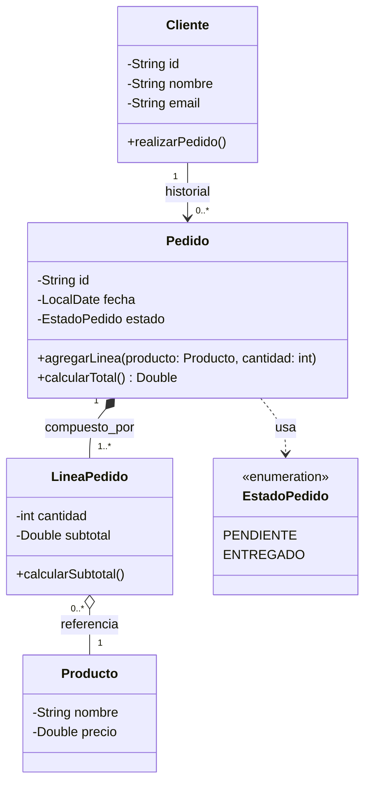
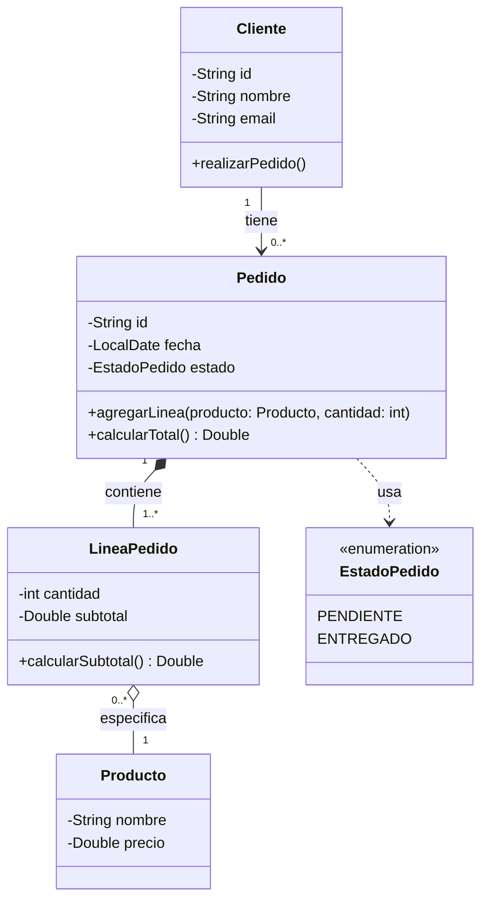

## Modelado-UML-Avanzado-Gesti-n-de-Pedidos:
Actúa como un experto en ingeniería de software y genera el código Mermaid.js para un diagrama de clases UML en Java, diseñado para documentación técnica en GitHub. El sistema debe modelar una tienda donde un Cliente tiene una relación de asociación con Pedido (1:N), permitiendo que los pedidos persistan como histórico si el cliente se elimina; sin embargo, cada Pedido debe tener una relación de composición con LineaPedido, de modo que estas se destruyan si el pedido desaparece. Incluye atributos con tipos de datos de Java (como String, Double, LocalDate), multiplicidad en las conexiones, un Enum para el EstadoPedido (PENDIENTE, ENTREGADO) y métodos clave como calcularTotal(), asegurando que cada LineaPedido esté vinculada a un Producto que contiene nombre y precio.

## Modelado-UML-Avanzado-Gesti-n-de-Pedidos:
Ahora vamos a editar el prompt base no incluyendo los tipos de agregaciones para observar si se generan automáticamente. 
Quiero diseñar el diagrama de clases UML de un sistema con clases en Java orientado a objetos, antes de programarlo. El sistema será una aplicación sencilla de gestión de pedidos para una tienda, con las siguientes funcionalidades: 
	Un Cliente puede realizar varios pedidos. 
	Cada Pedido tiene una fecha y un estado (pendiente o entregado). 
	Cada Pedido está compuesto por una o varias líneas de pedido. 
	Cada Línea de Pedido indica la cantidad de un Producto concreto. 
	Un Producto tiene nombre y precio. 
	Un Producto puede aparecer en muchas líneas de pedido. 
	Si se elimina un Pedido, sus líneas desaparecen. 
	Si se elimina un Cliente, los pedidos pueden mantenerse como histórico. 
	Requisitos del diagrama: Usa formato Mermaid. 

